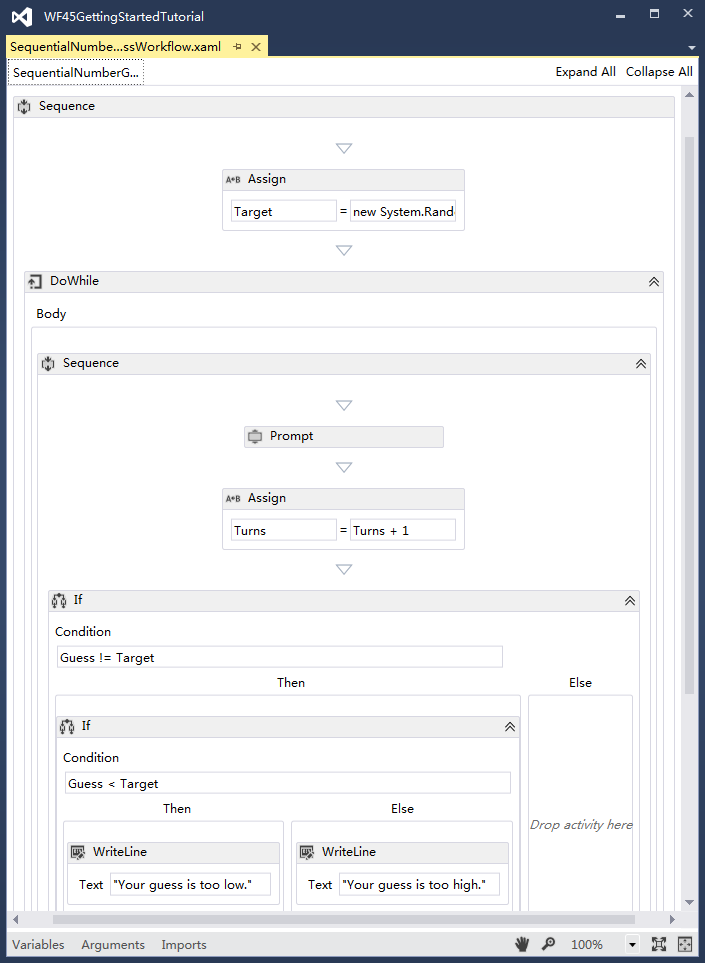
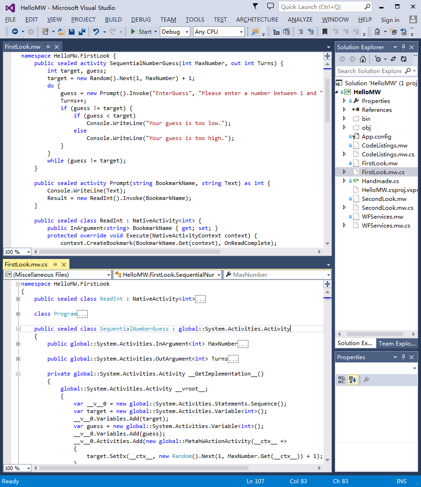
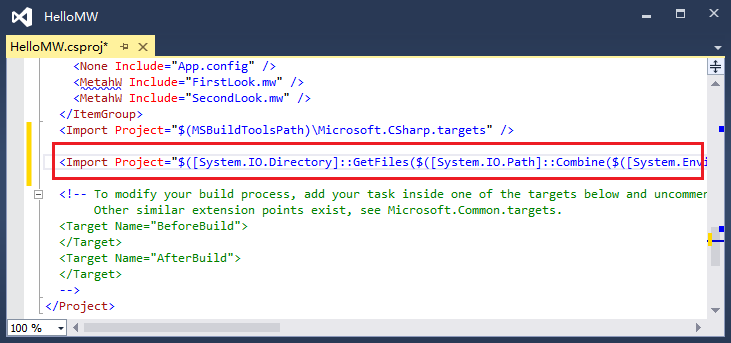
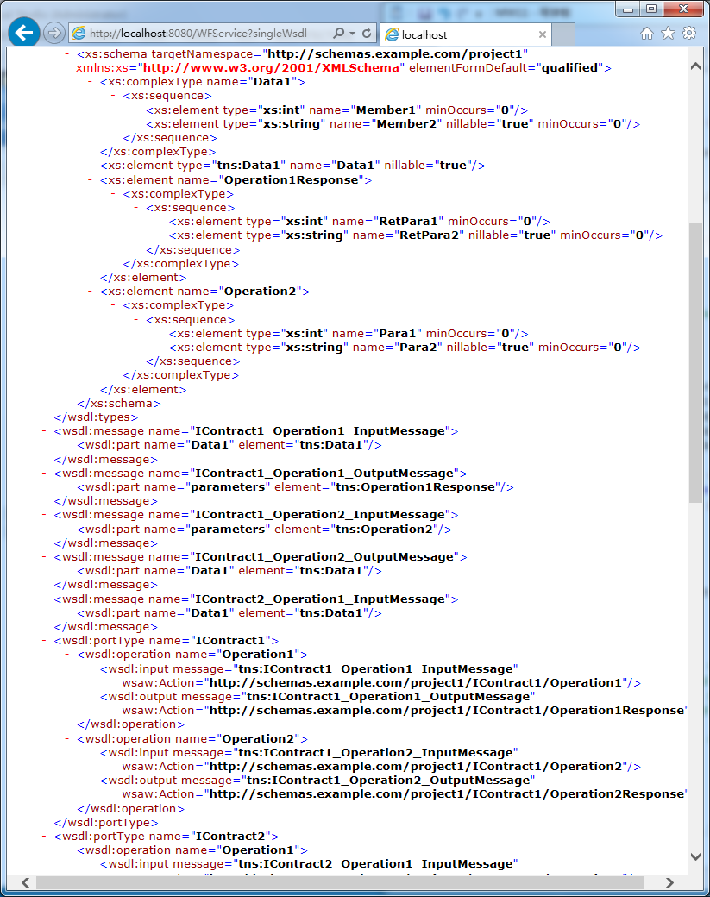

#Metah.W: A Workflow Metaprogramming Language#

Metah.W(MW) is a C#-derived metaprogramming language for Windows Workflow Foundation 4.5. It provides an alternative way of composing activities to the WF designer. Its website is [https://github.com/knat/Metah](https://github.com/knat/Metah).

This article assumes you are familiar with the WF 4.5 programming.

Namespace name abbreviations:

```
System.Activities -> SA
System.Activities.Statements -> SAS
System.ServiceModel.Activities -> SSA
```

All the code listings in this article are contained in [HelloMW project](../Examples/W/HelloMW).

I'm a .NET programmer in China and my English is not good(maybe poor), I'm very appreciative if you would improve this article.

## Introduction ##

The following figure, which is taken from the MSDN library ["Getting Started Tutorial"](http://msdn.microsoft.com/en-us/library/vstudio/gg983473(v=vs.110).aspx), represents a number guessing activity composed in the WF designer:



The WF designer generates XAML code. XAML is not a requirement for activity composing. It's perfectly legal and reasonable to compose activities in C#/VB. Actually, most of the composite activities in the MSDN [WF Samples](http://msdn.microsoft.com/en-us/library/vstudio/dd483375(v=vs.110).aspx) are written in C#/VB. `SequentialNumberGuess` in Handmade.cs is functionally equivalent to the XAML code of the preceding figure:

```C#
//Handmade.cs
using System;
using System.Threading;
using System.Collections.Generic;
using System.Activities;
using System.Activities.Expressions;
using System.Activities.Statements;

namespace Handmade {
    public sealed class SequentialNumberGuess : Activity {
        public InArgument<int> MaxNumber { get; set; }
        public OutArgument<int> Turns { get; set; }
        private Activity GetImplementation() {
            var target = new Variable<int>();
            var guess = new Variable<int>();
            return new Sequence {
                Variables = { target, guess },
                Activities = {
                    new Assign<int> {
                        To = new OutArgument<int>(target),
                        Value = new InArgument<int>(ctx => new Random().Next(1, MaxNumber.Get(ctx) + 1))
                    },
                    new DoWhile {
                        Body = new Sequence {
                            Activities = {
                                new Prompt {
                                    BookmarkName = "EnterGuess",
                                    Text = new InArgument<string>(ctx =>
                                        "Please enter a number between 1 and " + MaxNumber.Get(ctx)),
                                    Result = new OutArgument<int>(guess)
                                },
                                new Assign<int> {
                                    To = new OutArgument<int>(ctx => Turns.Get(ctx)),
                                    Value = new InArgument<int>(ctx => Turns.Get(ctx) + 1)
                                },
                                new If {
                                    Condition = new InArgument<bool>(ctx => guess.Get(ctx) != target.Get(ctx)),
                                    Then = new If {
                                        Condition = new InArgument<bool>(ctx => guess.Get(ctx) < target.Get(ctx)),
                                        Then = new WriteLine { Text = "Your guess is too low."},
                                        Else = new WriteLine { Text = "Your guess is too high."}
                                    }
                                }
                            }
                        },
                        Condition = new LambdaValue<bool>(ctx => guess.Get(ctx) != target.Get(ctx))
                    }
                }
            };
        }
        private Func<Activity> _implementation;
        protected override Func<Activity> Implementation {
            get {
                return _implementation ?? (_implementation = GetImplementation);
            }
            set { throw new NotSupportedException(); }
        }
    }

    public sealed class Prompt : Activity<int> {
        public InArgument<string> BookmarkName { get; set; }
        public InArgument<string> Text { get; set; }
        private Activity GetImplementation() {
            return new Sequence {
                Activities = {
                    new WriteLine {
                        Text = new InArgument<string>(ctx => Text.Get(ctx))
                    },
                    new ReadInt {
                        BookmarkName = new InArgument<string>(ctx => BookmarkName.Get(ctx)),
                        Result = new OutArgument<int>(ctx => Result.Get(ctx))
                    }
                }
            };
        }
        private Func<Activity> _implementation;
        protected override Func<Activity> Implementation {
            get {
                return _implementation ?? (_implementation = GetImplementation);
            }
            set { throw new NotSupportedException(); }
        }
    }

    public sealed class ReadInt : NativeActivity<int> {
        public InArgument<string> BookmarkName { get; set; }
        protected override void Execute(NativeActivityContext context) {
            context.CreateBookmark(BookmarkName.Get(context), OnReadComplete);
        }
        protected override bool CanInduceIdle { get { return true; } }
        void OnReadComplete(NativeActivityContext context, Bookmark bookmark, object state) {
            Result.Set(context, (int)state);
        }
    }

    class Program {
        static void Main() {
            var syncEvent = new AutoResetEvent(false);
            var idleEvent = new AutoResetEvent(false);
            var wfApp = new WorkflowApplication(new SequentialNumberGuess(),
                new Dictionary<string, object>() { { "MaxNumber", 100 } });
            wfApp.Completed = (WorkflowApplicationCompletedEventArgs e) => {
                Console.WriteLine("Congratulations, you guessed the number in {0} turns.", e.Outputs["Turns"]);
                syncEvent.Set();
            };
            wfApp.Aborted = (WorkflowApplicationAbortedEventArgs e) => {
                Console.WriteLine(e.Reason);
                syncEvent.Set();
            };
            wfApp.OnUnhandledException = (WorkflowApplicationUnhandledExceptionEventArgs e) => {
                Console.WriteLine(e.UnhandledException.ToString());
                return UnhandledExceptionAction.Terminate;
            };
            wfApp.Idle = (WorkflowApplicationIdleEventArgs e) => {
                idleEvent.Set();
            };
            wfApp.Run();
            var handles = new WaitHandle[] { syncEvent, idleEvent };
            while (WaitHandle.WaitAny(handles) == 1) {
                var isValidEntry = false;
                while (!isValidEntry) {
                    int guess;
                    if (!int.TryParse(Console.ReadLine(), out guess)) {
                        Console.WriteLine("Please enter an integer.");
                    }
                    else {
                        isValidEntry = true;
                        wfApp.ResumeBookmark("EnterGuess", guess);
                    }
                }
            }
        }
    }
}
```

We can classify activites into two groups: primitive activities and composite activities. Primitive activities inherit from `SA.CodeActivity`, `SA.CodeActivity<T>`, `SA.NativeActivity`, `SA.NativeActivity<T>`, etc. Composite activities, which directly inherit from `SA.Activity` or `SA.Activity<T>`, are composed of primitive/composite activities. In Handmade.cs, `SequentialNumberGuess` and `Prompt` are composite activities and `ReadInt` is a primitive activity.

As the preceding code demonstrates, composing activities in C#(/VB) is very verbose. Is there any way to simplify it? Yes! Welcome to the metaprogramming world and welcome to use Metah.W(MW):

(1). You need Visual Studio 2013;

(2). Download and install [the latest Metah vsix package](../Apps);

(3). Open VS 2013 -> New project -> Visual C# -> Metah.W -> Create a new Metah.W Console Application(or you can open [the HelloMW project](../Examples/W/HelloMW);

(4). Delete Program.cs;

(5). Add new item -> Visual C# Items -> Metah.W -> Create a new MW file named FirstLook.mw;

(6). Copy the following code into FirstLook.mw.


```C#
//FirstLook.mw
using System;
using System.Threading;
using System.Collections.Generic;
using System.Activities;
import HelloMW.FirstLook;

namespace HelloMW.FirstLook {
    public sealed activity SequentialNumberGuess(int MaxNumber, out int Turns) {
        int target, guess;
        target = new Random().Next(1, MaxNumber) + 1;
        do {
            guess = new Prompt().Invoke("EnterGuess", "Please enter a number between 1 and " + MaxNumber);
            Turns++;
            if (guess != target) {
                if (guess < target)
                    Console.WriteLine("Your guess is too low.");
                else
                    Console.WriteLine("Your guess is too high.");
            }
        }
        while (guess != target);
    }

    public sealed activity Prompt(string BookmarkName, string Text) as int {
        Console.WriteLine(Text);
        Result = new ReadInt().Invoke(BookmarkName);
    }

    public sealed class ReadInt : NativeActivity<int> {
        public InArgument<string> BookmarkName { get; set; }
        protected override void Execute(NativeActivityContext context) {
            context.CreateBookmark(BookmarkName.Get(context), OnReadComplete);
        }
        protected override bool CanInduceIdle { get { return true; } }
        void OnReadComplete(NativeActivityContext context, Bookmark bookmark, object state) {
            Result.Set(context, (int)state);
        }
    }

    class Program {
        static void Main() {
            var syncEvent = new AutoResetEvent(false);
            var idleEvent = new AutoResetEvent(false);
            var wfApp = new WorkflowApplication(new SequentialNumberGuess(),
                new Dictionary<string, object>() { { "MaxNumber", 100 } });
            wfApp.Completed = (WorkflowApplicationCompletedEventArgs e) => {
                Console.WriteLine("Congratulations, you guessed the number in {0} turns.", e.Outputs["Turns"]);
                syncEvent.Set();
            };
            wfApp.Aborted = (WorkflowApplicationAbortedEventArgs e) => {
                Console.WriteLine(e.Reason);
                syncEvent.Set();
            };
            wfApp.OnUnhandledException = (WorkflowApplicationUnhandledExceptionEventArgs e) => {
                Console.WriteLine(e.UnhandledException.ToString());
                return UnhandledExceptionAction.Terminate;
            };
            wfApp.Idle = (WorkflowApplicationIdleEventArgs e) => {
                idleEvent.Set();
            };
            wfApp.Run();
            var handles = new WaitHandle[] { syncEvent, idleEvent };
            while (WaitHandle.WaitAny(handles) == 1) {
                var isValidEntry = false;
                while (!isValidEntry) {
                    int guess;
                    if (!int.TryParse(Console.ReadLine(), out guess)) {
                        Console.WriteLine("Please enter an integer.");
                    }
                    else {
                        isValidEntry = true;
                        wfApp.ResumeBookmark("EnterGuess", guess);
                    }
                }
            }
        }
    }
}
```

MW extends from C#, so it is compatible with any C# code. Just as the WF designer, MW can only author composite activities. In FirstLook.mw, `SequentialNumberGuess` and `Prompt` are written in MW syntax(call them MW activities). MW activities are like functions. You can declare zero or more parameters(`MaxNumber`, `Turns`, `BookmarkName`, etc) and an optional return type(`as int` in `Prompt`). In an activity body, you can declare variables(`target`, `guess`) and use statements. MW statements can be C# expression statements(`target = new Random().Next(1, MaxNumber) + 1;`, etc), well-known statements(if-else, while, do-while, foreach, try-catch-finally, etc) or special statements(parallel, pick, state-machine, delay, receive, send-reply, etc). Because an MW activity is like a function, you can invoke it and assign the return value to a variable/parameter(`guess = new Prompt().Invoke(...)`). You can even invoke non-MW activities(`Result = new ReadInt().Invoke(BookmarkName)`)! Finally, you can use MW activities as normal activities(`new WorkflowApplication(new SequentialNumberGuess(), ...)`).

Build the project and click the "Show All Files" button in the solution explorer window. FirstLook.mw.cs is generated from FirstLook.mw by the MW compiler:

```C#
//FirstLook.mw.cs, generated by the MW compiler
//The using directives are generated as is
namespace HelloMW.FirstLook
{
    //Class ReadInt and Program are generated as is
    public sealed class SequentialNumberGuess : global::System.Activities.Activity
    {
        public global::System.Activities.InArgument<int> MaxNumber { get; set; }
        public global::System.Activities.OutArgument<int> Turns { get; set; }

        private global::System.Activities.Activity __GetImplementation__()
        {
            global::System.Activities.Activity __vroot__;
            {
                var __v__0 = new global::System.Activities.Statements.Sequence();
                var target = new global::System.Activities.Variable<int>();
                __v__0.Variables.Add(target);
                var guess = new global::System.Activities.Variable<int>();
                __v__0.Variables.Add(guess);
                __v__0.Activities.Add(new global::MetahWActionActivity(__ctx__ =>
                {
                    target.SetEx(__ctx__, new Random().Next(1, MaxNumber.Get(__ctx__)) + 1);
                }
                ));
                var __v__1 = new global::System.Activities.Statements.DoWhile();
                __v__1.Condition = new global::MetahWFuncActivity<bool>(__ctx__ => guess.Get(__ctx__) != target.Get(__ctx__));
                {
                    var __v__2 = new global::System.Activities.Statements.Sequence();
                    __v__2.Activities.Add(new Prompt().Initialize(__activity2__ =>
                    {
                        __activity2__.BookmarkName = new global::System.Activities.InArgument<string>(new global::MetahWFuncActivity<string>(__ctx__ => "EnterGuess"));
                        __activity2__.Text = new global::System.Activities.InArgument<string>(new global::MetahWFuncActivity<string>(__ctx__ => "Please enter a number between 1 and " + MaxNumber.Get(__ctx__)));
                        __activity2__.Result = new global::System.Activities.OutArgument<int>(new global::MetahWLocationActivity<int>(guess));
                    }
                    ));
                    __v__2.Activities.Add(new global::MetahWActionActivity(__ctx__ =>
                    {
                        Turns.SetEx(__ctx__, __val__ => ++__val__, true);
                    }
                    ));
                    var __v__3 = new global::System.Activities.Statements.If();
                    __v__3.Condition = new global::System.Activities.InArgument<bool>(new global::MetahWFuncActivity<bool>(__ctx__ => guess.Get(__ctx__) != target.Get(__ctx__)));
                    var __v__4 = new global::System.Activities.Statements.If();
                    __v__4.Condition = new global::System.Activities.InArgument<bool>(new global::MetahWFuncActivity<bool>(__ctx__ => guess.Get(__ctx__) < target.Get(__ctx__)));
                    __v__4.Then = new global::MetahWActionActivity(__ctx__ =>
                    {
                        Console.WriteLine("Your guess is too low.");
                    }
                    );
                    __v__4.Else = new global::MetahWActionActivity(__ctx__ =>
                    {
                        Console.WriteLine("Your guess is too high.");
                    }
                    );
                    __v__3.Then = __v__4;
                    __v__2.Activities.Add(__v__3);
                    __v__1.Body = __v__2;
                }
                __v__0.Activities.Add(__v__1);
                __vroot__ = __v__0;
            }
            return __vroot__;
        }

        private global::System.Func<global::System.Activities.Activity> __implementation__;
        protected override global::System.Func<global::System.Activities.Activity> Implementation
        {
            get
            {
                return __implementation__ ?? (__implementation__ = __GetImplementation__);
            }
            set
            {
                throw new global::System.NotSupportedException();
            }
        }
    }

    public sealed class Prompt : global::System.Activities.Activity<int>
    {
        public global::System.Activities.InArgument<string> BookmarkName { get; set; }
        public global::System.Activities.InArgument<string> Text { get; set; }

        private global::System.Activities.Activity __GetImplementation__()
        {
            global::System.Activities.Activity __vroot__;
            var __v__0 = new global::System.Activities.Statements.Sequence();
            __v__0.Activities.Add(new global::MetahWActionActivity(__ctx__ =>
            {
                Console.WriteLine(Text.Get(__ctx__));
            }
            ));
            __v__0.Activities.Add(new ReadInt().Initialize(__activity2__ =>
            {
                __activity2__.BookmarkName = new global::System.Activities.InArgument<string>(new global::MetahWFuncActivity<string>(__ctx__ => BookmarkName.Get(__ctx__)));
                __activity2__.Result = new global::System.Activities.OutArgument<int>(new global::MetahWLocationActivity<int>(Result));
            }
            ));
            __vroot__ = __v__0;
            return __vroot__;
        }

        private global::System.Func<global::System.Activities.Activity> __implementation__;
        protected override global::System.Func<global::System.Activities.Activity> Implementation
        {
            get
            {
                return __implementation__ ?? (__implementation__ = __GetImplementation__);
            }
            set
            {
                throw new global::System.NotSupportedException();
            }
        }
    }
}
//Helper code(extension methods, MetahWActionActivity, MetahWFuncActivity<T>, etc) is omitted
```



Here is another example:

```C#
//SecondLook.mw
using System;
using System.Activities;

namespace HelloMW.SecondLook
{
    class Program
    {
        static void Main()
        {
            WorkflowInvoker.Invoke(new Drive());
        }
    }

    public enum DriveAction { Neutral = 1, Forward, Reverse, TurnOff }

    activity Drive()
    {
        bool isMoved;
        isMoved = false;
        while (!isMoved)
        {
            statemachine goto InPark
            {
                DriveAction action;
            InPark:
                ~> Console.WriteLine("Enter InPark");
                <~ Console.WriteLine("Exit InPark");
                on action = new GetDriveAction().Invoke();
                    if (action == DriveAction.Neutral) goto InNeutral;
            InNeutral:
                ~> Console.WriteLine("Enter InNeutral");
                <~ Console.WriteLine("Exit InNeutral");
                on action = new GetDriveAction().Invoke();
                {
                    if (action == DriveAction.Forward) goto InForward;
                    if (action == DriveAction.Reverse) goto InReverse;
                    if (action == DriveAction.TurnOff) goto TurnedOff;
                }
            InForward:
                ~> { Console.WriteLine("Enter InForward"); isMoved = true; }
                <~ Console.WriteLine("Exit InForward");
                on action = new GetDriveAction().Invoke();
                    if (action == DriveAction.Neutral) goto InNeutral;
            InReverse:
                ~> { Console.WriteLine("Enter InReverse"); isMoved = true; }
                <~ Console.WriteLine("Exit InReverse");
                on action = new GetDriveAction().Invoke();
                    if (action == DriveAction.Neutral) goto InNeutral;
            TurnedOff: break
                ~> Console.WriteLine("TurnedOff");
            }
            Console.WriteLine("isMoved: " + isMoved);
        }
    }

    activity GetDriveAction() as DriveAction
    {
        delay TimeSpan.FromSeconds(1);
        Result = (DriveAction)_random.Next((int)DriveAction.Neutral, (int)DriveAction.TurnOff + 1);
        Console.WriteLine("!action: " + Result.ToString());
    }
    ##
    {
        private static readonly Random _random = new Random((int)DateTime.Now.Ticks);
    }
}
```

It's strongly recommended that you put some time on reading the generated code in Visual Studio.

So far, there are three methods of authoring composite activities: by the WF designer(XAML), by C#/VB and by Metah.W. I'm not a fan of the WF designer, for it is very awkward: working in the WF designer is like typing on a mini keyboard with thick gloves. If you love writing IL code, you certainly love writing composite activities in C#/VB. Metaprogramming is elegant and efficient, I think it is the best choice.

During the project compilation, firstly, the MW files(.mw) and the C# files of the project are sent to the MW compiler, the MW compiler parses and analyzes the MW files and generates C# files(.mw.cs) from them, then all the C# files(generated and normal) are sent to the C# compiler to generate the final CLR assembly.

MW projects extend from C# projects. Any existing C# projects can support MW by inserting the following code at the end of the .csproj file:

```xml
<Import Project="$([System.IO.Directory]::GetFiles($([System.IO.Path]::Combine($([System.Environment]::GetFolderPath(SpecialFolder.LocalApplicationData)), `Microsoft\VisualStudio\12.0\Extensions`)), `Metah.W.targets`, System.IO.SearchOption.AllDirectories))" />
```



##Activities##

MW extends from C#. Besides the reserved keywords of C#, MW adds the following reserved keywords: `activity`, `cancellable`, `confirm`, `compensable`, `compensate`, `contentcorr`, `delay`, `flow`, `fif`, `fswitch`, `import`, `nopersist`, `parallel`, `persist`, `pforecah`, `pick`, `receive`, `receivereply`, `send`, `sendreply`, `statemachine`, `terminate`, `transacted` and `transactedreceive`. This means if an identifier equals to one of them, you must use `@` to escape it(`@activity`, `@pick`, etc).

Grammar:

```
compilation-unit:
C#-extern-alias-directive* (import | C#-using-directive)* C#-global-attribute-list* namespace-member*
;
import:
'import' C#-namespace-name? ';'
;
namespace-member:
namespace | activity | C#-type-declaration
;
namespace:
'namespace' C#-namespace-name '{' C#-extern-alias-directive* C#-using-directive* namespace-member* '}'
;
activity:
C#-attribute-list* C#-class-modifier* 'activity' C#-identifier C#-type-parameter-list?
'(' (parameter (',' parameter)*)? ')' return-type?
(':' C#-interface-name (',' C#-interface-name)*)? C#-type-parameter-constraint-clause*
sequence-statement csharp-class-members-block?
;
parameter:
C#-attribute-list* ('out' | 'ref')? C#-type-name C#-identifier
;
return-type:
'as' C#-type-name
;
sequence-statement:
'{' variable* statement* '}'
;
csharp-class-members-block:
'##' '{' C#-class-member* '}'
;
```

An MW activity is the mixture of a C# class and a function. An example:

```C#
public class SomeAttribute1Attribute : Attribute { }
public class SomeAttribute2Attribute : Attribute { }
public interface ISomeInterface
{
    int Method();
}
public class SomeClass<T> where T : class, new() { }

[SomeAttribute1]
internal sealed activity A1<T>([RequiredArgument]int Arg1, [SomeAttribute2]out T Arg2, ref SomeClass<T> Arg3) as IEnumerable<T>
    : ISomeInterface where T : class, new()
{
}
##
{
    private int _i;
    int ISomeInterface.Method() { return ++_i; }
}

public sealed partial activity A2<T>(int Arg1, T Arg2) : ISomeInterface
{
}
partial class A2<T>
{
    private int _i;
    int ISomeInterface.Method() { return ++_i; }
}
```

The MW compiler translates an MW activity into a same-named activity class, C# code is generated as is:

```C#
public class SomeAttribute1Attribute : Attribute { }
public class SomeAttribute2Attribute : Attribute { }
public interface ISomeInterface
{
    int Method();
}
public class SomeClass<T> where T : class, new() { }

[SomeAttribute1]
internal sealed class A1<T> : global::System.Activities.Activity<IEnumerable<T>>, ISomeInterface where T : class, new()
{
    private int _i;
    int ISomeInterface.Method() { return ++_i; }
    [RequiredArgument]
    public global::System.Activities.InArgument<int> Arg1 { get; set; }
    [SomeAttribute2]
    public global::System.Activities.OutArgument<T> Arg2 { get; set; }
    public global::System.Activities.InOutArgument<SomeClass<T>> Arg3 { get; set; }
}

public sealed partial class A2<T> : global::System.Activities.Activity, ISomeInterface
{
    public global::System.Activities.InArgument<int> Arg1 { get; set; }
    public global::System.Activities.InArgument<T> Arg2 { get; set; }
}
partial class A2<T>
{
    private int _i;
    int ISomeInterface.Method() { return ++_i; }
}
```

If an MW activity declares a return type, the activity class inherits from `SA.Activity<ReturnTypeName>`, otherwise `SA.Activity`.

The direction of an MW parameter can be in(default), out(by `out` modifier) or in-out(by `ref` modifier). A same-named public property of type `SA.InArgument<ParaTypeName>`, `SA.OutArgument<ParaTypeName>` or `SA.InOutArgument<ParaTypeName>` is generated from the MW parameter. Bacause of this, it's strongly recommended capitalizing the first letter of the parameter name to comply with .NET conventions.

We can think an MW activity is the syntactic sugar for an activity class. Howerver, the MW compiler adds a conceptual(or fictional) `Invoke` method to the activity class. If an activity declares a return type, the return type of the method is the same as it, otherwise `void`. The parameters of the method are same as the parameters of the activity, and if all the directions are in, every parameter has a default value. From MW metaprogramming's perspectives, the activity classes of `A1<T>` and `A2` are:

```C#
[SomeAttribute1]
internal sealed class A1<T> : global::System.Activities.Activity<IEnumerable<T>>, ISomeInterface where T : class, new()
{
    private int _i;
    int ISomeInterface.Method() { return ++_i; }
    [RequiredArgument]
    public global::System.Activities.InArgument<int> Arg1 { get; set; }
    [SomeAttribute2]
    public global::System.Activities.OutArgument<T> Arg2 { get; set; }
    public global::System.Activities.InOutArgument<SomeClass<T>> Arg3 { get; set; }
    internal IEnumerable<T> Invoke(int Arg1, out T Arg2, ref SomeClass<T> Arg3)
    {
        throw new global::System.NotImplementedException();
    }
}

public sealed partial class A2<T> : global::System.Activities.Activity, ISomeInterface
{
    public global::System.Activities.InArgument<int> Arg1 { get; set; }
    public global::System.Activities.InArgument<T> Arg2 { get; set; }
    internal void Invoke(int Arg1 = default(int), T Arg2 = default(T))
    {
        throw new global::System.NotImplementedException();
    }
}
```

`Invoke` methods just exist in the metaprogramming phase, they have nothing to do with the generated code.

MW activities can invoke non-MW activities. Non-MW activities can be C# code in the same project or be IL code in the referenced assemblies. To invoke a non-MW activity you must first import it. Consider the following non-MW activities:

```C#
namespace NS1
{
    public class A3 : System.Activities.CodeActivity
    {
        public System.Activities.InArgument<int> Arg1 { get; set; }
        public System.Activities.InOutArgument<string> Arg2 { get; set; }
        ...
    }
    namespace NS2
    {
        public class A4<T> : System.Activities.NativeActivity<IEnumerable<T>>
        {
            public System.Activities.InArgument<int> Arg1 { get; set; }
            public System.Activities.InArgument<T> Arg2 { get; set; }
            ...
        }
    }
}
```

Use the `import` to import all the non-MW activities in a namespace:

```C#
import NS1;
import NS1.NS2;
```

Importing a non-MW activity means the MW compiler adds a conceptual(or fictional) `Invoke` method to the class. If the class inherits from `SA.Activity<T>`, the return type of the method is `T`, otherwise `void`. Every public property of type `SA.InArgument<T>`, `SA.OutArgument<T>` or `SA.InOutArgument<T>` is converted to the parameter of the method. From MW metaprogramming's perspectives, `A3` and `A4<T>` are:

```C#
namespace NS1
{
    public class A3 : System.Activities.CodeActivity
    {
        public System.Activities.InArgument<int> Arg1 { get; set; }
        public System.Activities.InOutArgument<string> Arg2 { get; set; }
        public void Invoke(int Arg1, ref string Arg2)
        {
            throw new global::System.NotImplementedException();
        }
        ...
    }
    namespace NS2
    {
        public class A4<T> : System.Activities.NativeActivity<IEnumerable<T>>
        {
            public System.Activities.InArgument<int> Arg1 { get; set; }
            public System.Activities.InArgument<T> Arg2 { get; set; }
            public IEnumerable<T> Invoke(int Arg1 = default(int), T Arg2 = default(T))
            {
                throw new global::System.NotImplementedException();
            }
            ...
        }
    }
}
```

The `import` has project-wide effects and the same namespace can be imported repeatedly. To import the global namespace, use:

```C#
import;
```

From callers' perspectives, `Invoke` methods have no difference between MW and non-MW activities.

##Variables, well-known statements and C# expression statements##

Grammar:

```
variable:
C#-type-name C#-identifier (',' C#-identifier)* ';'
;
statement:
csharp-expression-statement | csharp-block-statement | empty-statement | sequence-statement | if-statement | while-statement | do-while-statement | foreach-statement | switch-statement | throw-statement | try-statement | delay-statement | parallel-statement | parallel-foreach-statement | pick-statement | state-machine-statement | flow-statement | transacted-statement | cancellable-statement | compensable-statement | confirm-statement | compensate-statement | persist-statement | no-persist-statement | terminate-statement | receive-statement | send-reply-statement | send-statement | receive-reply-statement | content-correlation-statement | transacted-receive-statement
;
csharp-expression-statement:
C#-expression-statement
;
csharp-block-statement :
'##' C#-block-statement
;
empty-statement:
';'
;
if-statement:
'if' '(' C#-expression ')' statement ('else' statement)?
;
while-statement:
'while' '(' C#-expression ')' statement
;
do-while-statement:
'do' statement 'while' '(' C#-expression ')' ';'
;
foreach-statement:
'foreach' '(' C#-type-name C#-identifier 'in' C#-expression ')' statement
;
switch-statement:
'switch' '(' C#-expression ')' '{' switch-statement-case* switch-statement-default? '}'
;
switch-statement-case:
'case' C#-expression ':' statement? 'break' ';'
;
switch-statement-default:
'default' ':' statement? 'break' ';'
;
throw-statement:
'throw' C#-expression? ';'
;
try-statement:
'try' sequence-statement (try-statement-catch+ try-statement-finally? | try-statement-finally)
;
try-statement-catch:
'catch' '(' C#-type-name C#-identifier ')' sequence-statement
;
try-statement-finally:
'finally' sequence-statement
;
```

MW doesn't have the return statement. If an activity declares a return type, the MW compiler implicitly declares a reserved out paramenter named `Result` for returning the value:

```C#
activity GetDateTime() as DateTime
{
    Result = DateTime.Now;
}
```

Variables are declared just after a `{` and before any statements. You cannot assign a value to it in the declaration. The variable/parameter scoping rules are same as C#: 

```C#
activity Demo(int Arg1, bool Arg1/*ERROR: duplicate parameter name*/, int Result/*ERROR: duplicate parameter name*/) as long
{
    string Arg1;//ERROR: duplicate variable name
    int i;
    if (...)
    {
        int i;//ERROR: duplicate variable name
        int i2;
    }
    else
    {
        int i2;//OK
    }
}
```

Unlike C#, you can access(read) a varible or an out parameter without first assigning a value to it, it returns the default value:

```C#
activity NeedNotAssignValues(out SomeClass<Exception> Arg1) as bool
{
    string s;
    Console.WriteLine(Arg1 == default(SomeClass<Exception>));//True
    Console.WriteLine(Result == default(bool));//True
    Console.WriteLine(s == default(string));//True
}
```

This also means you needn't assign a value to an out parameter.

Authoring an MW activity means composing it from other activities. Every MW statement represents an activity:

<table border="1">
<tr><th>MW statement</th><th>Activity class</th></tr>
<tr><td>csharp-expression-statement</td><td>MetahWActionActivity/MetahWSequenceActivity/the invoked activity class</td></tr>
<tr><td>csharp-block-statement</td><td>MetahWActionActivity</td></tr>
<tr><td>empty-statement</td><td>MetahWActionActivity</td></tr>
<tr><td>sequence-statement</td><td>SAS.Sequence</td></tr>
<tr><td>if-statement</td><td>SAS.If</td></tr>
<tr><td>while-statement</td><td>SAS.While</td></tr>
<tr><td>do-while-statement</td><td>SAS.DoWhile</td></tr>
<tr><td>foreach-statement</td><td>SAS.ForEach&lt;T&gt;</td></tr>
<tr><td>switch-statement</td><td>SAS.Switch&lt;T&gt;</td></tr>
<tr><td>throw-statement</td><td>SAS.Throw/Rethrow</td></tr>
<tr><td>try-statement</td><td>SAS.TryCatch</td></tr>
<tr><td>delay-statement</td><td>SAS.Delay</td></tr>
<tr><td>parallel-statement</td><td>SAS.Parallel</td></tr>
<tr><td>parallel-foreach-statement</td><td>SAS.ParallelForEach&lt;T&gt;</td></tr>
<tr><td>pick-statement</td><td>SAS.Pick</td></tr>
<tr><td>state-machine-statement</td><td>SAS.StateMachine</td></tr>
<tr><td>flow-statement</td><td>SAS.Flowchart</td></tr>
<tr><td>transacted-statement</td><td>SAS.TransactionScope</td></tr>
<tr><td>cancellable-statement</td><td>SAS.CancellationScope</td></tr>
<tr><td>compensable-statement</td><td>SAS.CompensableActivity</td></tr>
<tr><td>confirm-statement</td><td>SAS.Confirm</td></tr>
<tr><td>compensate-statement</td><td>SAS.Compensate</td></tr>
<tr><td>persist-statement</td><td>SAS.Persist</td></tr>
<tr><td>no-persist-statement</td><td>SAS.NoPersistScope</td></tr>
<tr><td>terminate-statement</td><td>SAS.TerminateWorkflow</td></tr>
<tr><td>receive-statement</td><td>SSA.Receive</td></tr>
<tr><td>send-reply-statement</td><td>SSA.SendReply</td></tr>
<tr><td>send-statement</td><td>SSA.Send</td></tr>
<tr><td>receive-reply-statement</td><td>SSA.ReceiveReply</td></tr>
<tr><td>content-correlation-statement</td><td>SSA.InitializeCorrelation</td></tr>
<tr><td>transacted-receive-statement</td><td>SSA.TransactedReceiveScope</td></tr>
</table>

The MW compier tries to do some optimization: two or more contiguous `csharp-expression-statement`s/`csharp-block-statement`s may be generated as a single `MetahWActionActivity`; if a `sequence-statement` has only one member statement, the `sequence-statement` is discarded and the member statement is used.

The `empty-statement`, `sequence-statement`, `if-statement`, `while-statement`, `do-while-statement`, `foreach-statement`, `switch-statement`, `throw-statement` and `try-statement` are well-known:

```C#
activity WellknownStatements()
{
    try
    {
        foreach(int i in new[]{2,3,5,7,11,13,17})
        {
            Console.Write(i + ": ");
            switch(i)
            {
                case 2:
                    Console.WriteLine("even number");
                    break;
                case 7:
                    Console.WriteLine("lucky number");
                    break;
                case 13:
                    {
                        Console.WriteLine("bad number");
                        throw new ArgumentException("bad number 13");
                    }
                    break;
                default:
                    Console.WriteLine("normal number");
                    break;
            }
            if(i == 2)
            {
                int j;
                j = i;
                while(j++ < 7);
            }
        }
    }
    catch(ArgumentException ex)
    {
        Console.WriteLine(ex);
    }
    catch(Exception ex)
    {
        throw;
    }
    finally
    {
        Console.WriteLine("finally");
    }
}
```

You can use the `csharp-expression-statement` freely.

The following code demonstrates the `csharp-block-statement`:

```C#
activity CSharpBlock(int Arg1, string Arg2) as bool
{
    int i;
    ##
    {
        if(Arg1 < 0) throw new ArgumentOutOfRangeException("Arg1");//They are C# statements
        Result = int.TryParse(Arg2, out i);
        var i2 = Arg1 + i;//It's a C# variable
        for(; i < i2; i++);//They are C# statements
        //...
    }
    //...
}
```

Consider the following code:

```C#
activity UseMWStatements(int Arg1, string Arg2)
{
    if(Arg1 < 0) throw new ArgumentOutOfRangeException("Arg1");//They are MW statements
    if(string.IsNullOrEmpty(Arg2)) throw new ArgumentNullException("Arg2");//They are MW statements
}

activity UseCSStatements(int Arg1, string Arg2)
{
    ##
    {
        if(Arg1 < 0) throw new ArgumentOutOfRangeException("Arg1");//They are C# statements
        if(string.IsNullOrEmpty(Arg2)) throw new ArgumentNullException("Arg2");//They are C# statements
    }
}
```

MW statements are much slower than the corresponding C# statements, so it's recommended using C# statements as much as possible to improve the performance.

You can invoke another activity by invoking the `Invoke` method. An activity invocation is just a C# invocation expression, so you can use it freely:

```C#
activity TryParse(string String, out int Value) as bool
{
    Result = int.TryParse(String, out Value);
}

activity RepeatString(String String, int Count) as string
{
    ##
    {
        for (var i = 0; i < Count; i++)
            Result += String;
    }
}

activity GetUpperChars(string String, out char[] Chars) as int
{
    Chars = String.Where(ch => {
        var isUpper = char.IsUpper(ch);
        if (isUpper) Result++;
        return isUpper;
    }).ToArray();
}

activity InvokeActivities(string String, string Count)
{
    int count;
    char[] chars;
    if (new TryParse().Invoke(Count, out count) && count > 0 && new GetUpperChars().Invoke(new RepeatString().Invoke(String, count), out chars) > 0)
    ##
    {
        foreach(var ch in chars)
            Console.WriteLine(ch);
    }
    else
        Console.WriteLine("Invalid arguments. String: {0}, Count: {1}", String, Count);
}
```

Activity invocations cannot be used in `csharp-block-statement`s, lambda expressions, anonymous methods or query expression bodies:

```C#
activity GetChars() as IEnumerable<char>
{
    Result = "AbcD";
}
activity IsUpper(char Char) as bool
{
    Result = char.IsUpper(Char);
}
activity Demo()
{
    IEnumerable<char> chars;
    ##
    {
        chars = new GetChars().Invoke();//ERROR: activity invocations cannot be used in C# block statements
    }
    chars = "AbcD".Where(ch => new IsUpper().Invoke(ch));//ERROR: activity invocations cannot be used in lambda expressions
    chars = from ch in "AbcD" where new IsUpper().Invoke(ch) select ch;//ERROR: activity invocations cannot be used in query expression bodies
    chars = from ch in new GetChars().Invoke() where char.IsUpper(ch) select ch;//OK. Activity invocations CAN be used in query expression from clauses
}
```

An activity cannot invoke itself directly or indirectly:

```C#
//Fibonacci() can pass the compilation but falls into a dead loop when running
activity Fibonacci(int Value) as int
{
    Result = Value <= 1 ? 1 : new Fibonacci().Invoke(Value - 1) + new Fibonacci().Invoke(Value - 2);
}
```

Invoking an activity means containing it, an activity cannot contain itself directly or indirectly.

##Activity delegates and invocations##

The MW compiler adds a conceptual(or fictional) `Invoke` method to every activity delegate. From MW metaprogramming's perspectives, the activity delegates are:

```C#
namespace System.Activities
{
    public sealed class ActivityAction : ...
    {
        public void Invoke() { throw new NotImplementedException();}
        ...
    }
    public sealed class ActivityAction<T1> : ...
    {
        public void Invoke(T1 arg1) { throw new NotImplementedException();}
        ...
    }
    public sealed class ActivityAction<T1, T2> : ...
    {
        public void Invoke(T1 arg1, T2 arg2) { throw new NotImplementedException();}
        ...
    }
    ...
    public sealed class ActivityAction<T1, T2, ..., T16> : ...
    {
        public void Invoke(T1 arg1, T2 arg2, ..., T16 arg16) { throw new NotImplementedException();}
        ...
    }
    public sealed class ActivityFunc<TResult> : ...
    {
        public TResult Invoke() { throw new NotImplementedException();}
        ...
    }
    public sealed class ActivityFunc<T1, TResult> : ...
    {
        public TResult Invoke(T1 arg1) { throw new NotImplementedException();}
        ...
    }
    public sealed class ActivityFunc<T1, T2, TResult> : ...
    {
        public TResult Invoke(T1 arg1, T2 arg2) { throw new NotImplementedException();}
        ...
    }
    ...
    public sealed class ActivityFunc<T1, T2, ..., T16, TResult> : ...
    {
        public TResult Invoke(T1 arg1, T2 arg2, ..., T16 arg16) { throw new NotImplementedException();}
        ...
    }
}
```

The MW compiler generates some extension methods for creating activity delegates from activities:

```C#
//global namespace
internal static class MetahWExtensions
{
    internal static ActivityAction ToAction(this Activity activity) {...}
    internal static ActivityAction<T1> ToAction<TActivity, T1>(this TActivity activity, Action<TActivity, InArgument<T1>> initializer) where TActivity : Activity {...}
    internal static ActivityAction<T1, T2> ToAction<TActivity, T1, T2>(this TActivity activity, Action<TActivity, InArgument<T1>, InArgument<T2>> initializer) where TActivity : Activity {...}
    ...
    internal static ActivityAction<T1, T2, ..., T16> ToAction<TActivity, T1, T2, ..., T16>(this TActivity activity, Action<TActivity, InArgument<T1>, InArgument<T2>, ..., InArgument<T16>> initializer) where TActivity : Activity {...}
    internal static ActivityFunc<TResult> ToFunc<TActivity, TResult>(this TActivity activity, Action<TActivity, OutArgument<TResult>> initializer) where TActivity : Activity {...}
    internal static ActivityFunc<T1, TResult> ToFunc<TActivity, T1, TResult>(this TActivity activity, Action<TActivity, InArgument<T1>, OutArgument<TResult>> initializer) where TActivity : Activity {...}
    internal static ActivityFunc<T1, T2, TResult> ToFunc<TActivity, T1, T2, TResult>(this TActivity activity, Action<TActivity, InArgument<T1>, InArgument<T2>, OutArgument<TResult>> initializer) where TActivity : Activity {...}
    ...
    internal static ActivityFunc<T1, T2, ..., T16, TResult> ToFunc<TActivity, T1, T2, ..., T16, TResult>(this TActivity activity, Action<TActivity, InArgument<T1>, InArgument<T2>, ..., InArgument<T16>, OutArgument<TResult>> initializer) where TActivity : Activity {...}
}
```

The following code demonstrates the whole usage:

```C#
activity InvokeDelegates()
{
    if(Action != null)
        Action.Invoke();
    if(Action1 != null)
        Action1.Invoke(1);
    if(Action2 != null)
        Action2.Invoke(2, "Action2");
    if(Func != null)
        Console.WriteLine("Invoker(): " + Func.Invoke());
    if(Func1 != null)
        Console.WriteLine("Invoker(): " + Func1.Invoke(11));
    if(Func2 != null)
        Console.WriteLine("Invoker(): " + Func2.Invoke(12, "Func2"));
}
##
{
    public ActivityAction Action { get; set; }//Activity delegates must be passed via properties or fields
    public ActivityAction<int> Action1 { get; set; }
    public ActivityAction<int, string> Action2 { get; set; }
    public ActivityFunc<string> Func { get; set; }
    public ActivityFunc<int, string> Func1 { get; set; }
    public ActivityFunc<int, string, string> Func2 { get; set; }
}

activity Display(string String, int Int32) as string
{
    Result = string.Format("String: {0}, Int32: {1}", String, Int32);
    Console.WriteLine("Display(): " + Result);
}

activity ActivityDelegatesTest()
{
    new InvokeDelegates {
        Action = new Display().ToAction(),
        Action1 = new Display().ToAction<Display, int>((act, arg1) => {
            act.Int32 = arg1;
        }),
        Action2 = new Display().ToAction<Display, int, string>((act, arg1, arg2) => {
            act.Int32 = arg1;
            act.String = arg2;
        }),
        Func = new Display().ToFunc<Display, string>((act, result) => {
            act.Result = result;
        }),
        Func1 = new Display().ToFunc<Display, int, string>((act, arg1, result) => {
            act.Int32 = arg1;
            act.Result = result;
        }),
        Func2 = new Display().ToFunc<Display, int, string, string>((act, arg1, arg2, result) => {
            act.Int32 = arg1;
            act.String = arg2;
            act.Result = result;
        }),
    }.Invoke();
/*output:
Display(): String: , Int32: 0
Display(): String: , Int32: 1
Display(): String: Action2, Int32: 2
Display(): String: , Int32: 0
Invoker(): String: , Int32: 0
Display(): String: , Int32: 11
Invoker(): String: , Int32: 11
Display(): String: Func2, Int32: 12
Invoker(): String: Func2, Int32: 12
*/
}
```

##Delay, parallel and parallel-foreach statements##

Grammar:

```
delay-statement:
'delay' C#-expression ';'
;
parallel-statement:
'parallel' sequence-statement until-clause?
;
parallel-foreach-statement:
'pforeach' '(' C#-type-name C#-identifier 'in' C#-expression ')' statement until-clause?
;
until-clause:
'until' C#-expression ';'
;
```

The expression type of the `delay-statement` must be `System.TimeSpan`. The expression type of the `until-clause` must be `bool`. For the `parallel-statement`, every member statement is a branch; for the `parallel-foreach-statement`, every item is a branch. The `parallel(-foreach)-statement` executes all the branches in parallel. After one branch ends, if the `until-clause` exists and is evaluated to true, the `parallel(-foreach)-statement` ends and all other branches are canceled, otherwise the `parallel(-foreach)-statement` waits for another branch to end and the `until-clause`(if any) is evaluated again, until all the branches end. An example:

```C#
activity Delay(int Seconds)
{
    Console.WriteLine("Begin to delay {0} seconds", Seconds);
    delay TimeSpan.FromSeconds(Seconds);
    Console.WriteLine("End delaying {0} seconds", Seconds);
}

activity Parallel()
{
    parallel
    {
        //branch 1
        new Delay().Invoke(4);
        //branch 2
        new Delay().Invoke(2);
    }
/*output:
Begin to delay 4 seconds
Begin to delay 2 seconds
End delaying 2 seconds
End delaying 4 seconds
*/
}

activity Parallel2()
{
    parallel
    {
        //branch 1
        new Delay().Invoke(4);
        //branch 2
        new Delay().Invoke(2);
    }
    until true;
/*output:
Begin to delay 4 seconds
Begin to delay 2 seconds
End delaying 2 seconds
*/
}

activity ParallelForeach()
{
    pforeach(int seconds in new []{4, 2, 6})
        new Delay().Invoke(seconds);
/*output:
Begin to delay 6 seconds
Begin to delay 2 seconds
Begin to delay 4 seconds
End delaying 2 seconds
End delaying 4 seconds
End delaying 6 seconds
*/
}

activity ParallelForeach2()
{
    pforeach(int seconds in new []{4, 2, 6})
        new Delay().Invoke(seconds);
    until true;
/*output:
Begin to delay 6 seconds
Begin to delay 2 seconds
Begin to delay 4 seconds
End delaying 2 seconds
*/
}
```

##Pick statements##

Grammar: 

```
pick-statement:
'pick' '{' pick-statement-branch* '}'
;
pick-statement-branch:
trigger-clause action-clause?
| '{' variable* trigger-clause action-clause? '}'
;
trigger-clause:
'on' statement
;
action-clause:
'do' statement
;
```

You can declare variables just after a `{` except for the `pick-statement`. This is because the `SAS.Pick` cannot contain variables, maybe this is the Microsoft's carelessness. The `pick-statement` executes all the `trigger-clause`s in parallel. After one trigger ends, all other triggers are canceled and the corresponding `action-clause`(if any) is executed. After the `action-clause` ends, the `pick-statement` ends. An example:

```C#
activity Pick()
{
    pick
    {
        //brach 1
        on new Delay().Invoke(4);
            do Console.WriteLine("After 4 seconds");
        //brach 2
        on new Delay().Invoke(2);
            do Console.WriteLine("After 2 seconds");
    }
/*output:
Begin to delay 4 seconds
Begin to delay 2 seconds
End delaying 2 seconds
After 2 seconds
*/
}
```

##State-machine statements##

Grammar:

```
state-machine-statement:
'statemachine' goto-clause? '{' variable* state-machine-statement-node+ '}'
;
state-machine-statement-node:
state-machine-statement-common-node | state-machine-statement-final-node
;
state-machine-statement-final-node:
label-clause 'break' (';' | entry-clause)
;
label-clause:
C#-identifier ':'
;
goto-clause:
'goto' C#-identifier
;
entry-clause:
'~>' statement
;
exit-clause:
'<~' statement
;
state-machine-statement-common-node:
label-clause
( entry-clause? exit-clause? state-machine-statement-transition+
| '{' variable* entry-clause? exit-clause? state-machine-statement-transition+ '}' )
;
state-machine-statement-transition:
state-machine-statement-transition-with-trigger | state-machine-statement-transition-body
;
state-machine-statement-transition-with-trigger:
trigger-clause (state-machine-statement-transition-body | '{' state-machine-statement-transition-body+ '}')
;
state-machine-statement-transition-body:
condition-clause? action-clause? goto-clause ';'
;
condition-clause:
'if' '(' C#-expression ')'
;
```

A `state-machine-statement` must have at least one common node and one final node. Every node is identified by a unique label. If a state-machine declares a `goto-clause`(it must reference to a common node), the execution is transfered to that common node, otherwise the first declared common node. After the execution enters a node, the `entry-clause`(if any) is executed. The `state-machine-statement-transition` transfers the execution to another node(maybe self node). A transition without the `trigger-clause` is like it has a fictional trigger which ends immediately. All the triggers of the common node are exectuted in parallel. After one trigger ends(other triggers are NOT canceled), the `condition-clause`(s) of the trigger are evaluated in the declared order. A transition body without the `condition-clause` is like it has a fictional condition which always returns true. If the condition is evaluated to true, the `exit-clause`(if any) is executed and the corresponding `action-clause`(if any) is executed and the the execution is transfered to the node specified by the corresponding `goto-clause`(other running triggers are canceled). If the condition is evaluated to false, the next condition is evaluated. If all the conditions are evaluated to false, that trigger is exectuted again. After a final node ends, the state-machine ends. Besides SecondLook.mw, here is another example:

```C#
activity DelayEx(int Seconds) as int
{
    Console.WriteLine("Begin to delay {0} seconds", Seconds);
    delay TimeSpan.FromSeconds(Seconds);
    Result = _random.Next(5);
    Console.WriteLine("End delaying {0} seconds. Result: {1}", Seconds, Result);
}
##
{
    private static readonly Random _random = new Random((int)DateTime.Now.Ticks);
}

activity StateMachine(bool Arg1)
{
    statemachine
    {
    Node1:
        ~> Console.WriteLine("~> Node1");
        <~ Console.WriteLine("<~ Node1");
        if(!Arg1) do Console.WriteLine("Node1: goto Node2"); goto Node2;
        if(Arg1) do Console.WriteLine("Node1: goto Node3"); goto Node3;
    Node2:
    {
        int value;
        ~> Console.WriteLine("~> Node2");
        <~ Console.WriteLine("<~ Node2");
        on value = new DelayEx().Invoke(5);
        {
            if(value == 3) do Console.WriteLine("Node2.delay(5).value==3: goto Node3"); goto Node3;
            if(value == 4) do Console.WriteLine("Node2.delay(5).value==4: goto Node4"); goto Node4;
        }
        on value = new DelayEx().Invoke(3);
            if(value == 2) do Console.WriteLine("Node2.delay(3).value==2: goto Node2"); goto Node2;
        on value = new DelayEx().Invoke(20);
            do Console.WriteLine("Node2.delay(20): goto Final"); goto Final;
    }
    Node3:
    {
        int value;
        ~> Console.WriteLine("~> Node3");
        <~ Console.WriteLine("<~ Node3");
        on value = new DelayEx().Invoke(1);
        {
            if(value < 3) do Console.WriteLine("Node3.delay(1).value<3: goto Node2"); goto Node2;
            if(value >= 3) do Console.WriteLine("Node3.delay(1).value>=3: goto Final"); goto Final;
        }
    }
    Node4:
        ~> Console.WriteLine("~> Node4");
        <~ Console.WriteLine("<~ Node4");
        goto Final;
    Final: break
        ~> Console.WriteLine("~> Final");
    }
/*possible output:
~> Node1
<~ Node1
Node1: goto Node2
~> Node2
Begin to delay 20 seconds
Begin to delay 3 seconds
Begin to delay 5 seconds
End delaying 3 seconds. Result: 2
<~ Node2
Node2.delay(3).value==2: goto Node2
~> Node2
Begin to delay 20 seconds
Begin to delay 3 seconds
Begin to delay 5 seconds
End delaying 3 seconds. Result: 4
Begin to delay 3 seconds
End delaying 5 seconds. Result: 4
<~ Node2
Node2.delay(5).value==4: goto Node4
~> Node4
<~ Node4
~> Final
*/
}
```

##Flow statements##

Grammar:

```
flow-statement:
'flow' goto-clause? '{' variable* flow-statement-node+ '}'
;
flow-statement-node:
flow-statement-step-node | flow-statement-if-node | flow-statement-switch-node
;
flow-statement-step-node:
label-clause statement flow-statement-jump
;
flow-statement-if-node:
label-clause 'fif' '(' C#-expression ')' flow-statement-jump ('else' flow-statement-jump)?
;
flow-statement-switch-node:
label-clause 'fswitch' '(' C#-expression ')' '{' flow-statement-switch-node-case* flow-statement-switch-node-default? '}'
;
flow-statement-switch-node-case:
'case' C#-expression ':' flow-statement-jump
;
flow-statement-switch-node-default:
'default' ':' flow-statement-jump
;
flow-statement-jump:
(goto-clause | 'break') ';'
;
```

Every flow node is identified by a unique label. If a `flow-statement` declares a `goto-clause`, the execution is transfered to the specified node, otherwise the first node. The `break` means quiting the flow. If the condition of a `fif` is evaluated to false and there is no `else` clause, or if there is no switch-default and no switch-case matching with the switch value, the `flow-statement` ends. An example:

```C#
activity Flow(int Number)
{
    flow goto Begin
    {
        Begin:
            Console.Write(Number + ": ");
            goto IsValid;
        IsValid:
            fif (Number > 0 && Number < 20) goto Evaluate;
            else goto InvalidNumber;
        Evaluate:
            fswitch(Number)
            {
                case 7: goto LuckyNumber;
                case 13: goto BadNumber;
                default: goto NormalNumber;
            }
        LuckyNumber:
            Console.WriteLine("lucky number");
            break;
        BadNumber:
            Console.WriteLine("bad number");
            break;
        NormalNumber:
            {
                Console.WriteLine("normal number");
                Number++;
            }
            goto Begin;
        InvalidNumber:
            Console.WriteLine("invalid number");
            break;
    }
}

activity FlowTest()
{
    foreach(int number in new int[]{7, 0, 13, 5})
        new Flow().Invoke(number);
/*output:
7: lucky number
0: invalid number
13: bad number
5: normal number
6: normal number
7: lucky number
*/
}
```

##Transaction statements##

Grammar:

```
transacted-statement:
'transacted' sequence-statement ((timeout-clause init-clause? | init-clause) ';')?
;
timeout-clause:
'timeout' C#-expression
;
init-clause:
'init' C#Expression
;
cancellable-statement:
'cancellable' sequence-statement cancellation-handler
;
cancellation-handler:
'cancel' sequence-statement
;
compensable-statement:
'compensable' ('explicit'? C#Identifier)? sequence-statement confirmation-handler? compensation-handler? cancellation-handler?
;
confirmation-handler:
'confirm' sequence-statement
;
compensation-handler:
'compensate' sequence-statement
;
confirm-statement:
'confirm' C#-expression? ';'
;
compensate-statement:
'compensate' C#-expression? ';'
;
```

The expression type of the `timeout-clause` must be `System.TimeSpan`. The expression type of the `init-clause` of the `transacted-statement` must be `System.Action<SAS.TransactionScope>`. An example for the `transacted-statement`:

```C#
activity Transacted(int Arg1)
{
    transacted
    {
        //...
    }
    timeout TimeSpan.FromSeconds(Arg1)
    init (System.Activities.Statements.TransactionScope ts) => {
        ts.IsolationLevel = System.Transactions.IsolationLevel.RepeatableRead;
        ts.AbortInstanceOnTransactionFailure = false;
    }
    ;
}
```

For more information, please refer to the MSDN library ["Workflow Transactions"](http://msdn.microsoft.com/en-us/library/vstudio/dd489430(v=vs.110).aspx).

An example for the `cancellable-statement`:

```C#
activity Cancellable()
{
    parallel
    {
        //branch 1
        cancellable
        {
            new Delay().Invoke(4);
        }
        cancel
        {
            Console.WriteLine("Cancellation handler for delaying 4 seconds");
        }
        //branch 2
        cancellable
        {
            new Delay().Invoke(2);
        }
        cancel
        {
            Console.WriteLine("Cancellation handler for delaying 2 seconds");
        }
    }
    until true;
/*output:
Begin to delay 4 seconds
Begin to delay 2 seconds
End delaying 2 seconds
Cancellation handler for delaying 4 seconds
*/
}
```

For more information, please refer to the MSDN library ["Modeling Cancellation Behavior in Workflows"](http://msdn.microsoft.com/en-us/library/vstudio/ff407124(v=vs.110).aspx).

An example for the `compensable-statement`, `confirm-statement` and `compensate-statement`:

```C#
activity Compensable(bool Arg1)
{
    compensable cToken
    {
        new Delay().Invoke(4);
    }
    confirm
    {
        Console.WriteLine("Confirmation handler");
    }
    compensate
    {
        Console.WriteLine("Compensation handler");
    }
    cancel
    {
        Console.WriteLine("Cancellation handler");
    }
    if(Arg1) confirm cToken;
    else compensate cToken;
}
```

In the preceding code, the MW compiler automatically creates a token variable of type `SAS.CompensationToken` with name `cToken` and binds it to the `compensable-statement`, so you can use the variable in the `confirm-statement` and `compensate-statement`. You can explicitly bind an existing token variable/parameter to the `compensable-statement`:

```C#
activity Compensable2() as System.Activities.Statements.CompensationToken
{
    compensable explicit Result
    {
        new Delay().Invoke(4);
    }
    confirm
    {
        Console.WriteLine("Confirmation handler");
    }
    compensate
    {
        Console.WriteLine("Compensation handler");
    }
    cancel
    {
        Console.WriteLine("Cancellation handler");
    }
}
activity Compensable2Test()
{
    confirm new Compensable2().Invoke();
}
```

For more information, please refer to the MSDN library ["Compensation"](http://msdn.microsoft.com/en-us/library/vstudio/dd489432(v=vs.110).aspx).

##Runtime statements##

Grammar:

```
persist-statement:
'persist' ';'
;
no-persist-statement:
'nopersist' sequence-statement
;
terminate-statement:
'terminate' (reason-clause exception-clause? | exception-clause) ';'
;
reason-clause:
'for' C#-expression
;
exception-clause:
'throw' C#-expression
;
```

An example:

```C#
activity RuntimeStatements()
{
    persist;
    nopersist
    {
        //...
    }
    terminate for "reason message" throw new Exception("exception message");
}
```

For more information, please refer to the MSDN library ["Runtime Activities in WF"](http://msdn.microsoft.com/en-us/library/vstudio/ee358752(v=vs.110).aspx).

##Service statements##

You should be familiar with [the WF services and the API](http://msdn.microsoft.com/en-us/library/vstudio/dd456788(v=vs.110).aspx). If so, open [the HelloMW project](../Examples/W/HelloMW) in Visual Studio and view the WFServices.mw and the generated WFServices.mw.cs, you will understand the MW service statements easily.

Grammar:

```
receive-statement:
'receive' contract-operation-name-pair receive-content
request-reply-correlation? callback-correlation?
('ref' (ref-context-correlation | ref-content-correlation | ref-callback-correlation))?
init-clause? ';'
;
send-reply-statement:
'sendreply' send-content
context-correlation? content-correlation?
('ref' request-reply-correlation)?
init-clause? ';'
;
send-statement:
'send' contract-operation-name-pair send-content
request-reply-correlation? callback-correlation?
('ref' (ref-context-correlation | ref-callback-correlation))?
endpoint-address-clause? init-clause? ';'
;
receive-reply-statement:
'receivereply' receive-content
context-correlation?
('ref' request-reply-correlation)?
init-clause? ';'
;
contract-operation-name-pair:
'{' C#-expression ',' C#-expression '}'
;
endpoint-address-clause:
'endpointaddress' C#-expression
;
receive-content:
'(' (receive-message-content | receive-parameters-content)? ')'
;
receive-message-content:
'~>' C#-identifier
;
receive-parameters-content:
receive-content-parameter (',' receive-content-parameter)*
;
receive-content-parameter:
C#-expression '~>' C#-identifier
;
send-content:
'(' (send-message-content | send-parameters-content)? ')'
;
send-message-content:
'<~' C#-expression
;
send-parameters-content:
send-content-parameter (',' send-content-parameter)*
;
send-content-parameter:
C#-expression '<~' C#-expression
;
request-reply-correlation:
'requestcorr' C#-identifier
;
context-correlation:
'contextcorr' (C#-identifier | 'explicit' C#-expression)
;
ref-context-correlation:
'contextcorr' C#-expression
;
callback-correlation:
'callbackcorr' (C#-identifier | 'explicit' C#-expression)
;
ref-callback-correlation:
'callbackcorr' C#-expression
;
content-correlation:
'contentcorr' (C#-identifier | 'explicit' C#-expression) 'on' C#-expression
;
ref-content-correlation:
'contentcorr' C#-expression 'on' C#-expression
;
content-correlation-statement:
'contentcorr' (C#-identifier | 'explicit' C#-expression) 'on' content-correlation-statement-data (',' content-correlation-statement-data)*
;
content-correlation-statement-data:
'{' C#-expression ',' C#-expression '}'
;
transacted-receive-statement:
'transactedreceive' sequence-statement
;
```

There are essentially two message exchange patterns(MEP): request-response and datagram. A `receive-statement` and a `send-reply-statement` form a request-response service operation, a `send-statement` and a `receive-reply-statement` consume a request-response service operation. A single `receive-statement` forms a datagram service operation, a single `send-statement` consumes a datagram service operation. We can call the `receive-statement` and the `send-reply-statement` service side statements, the `send-statement` and the `receive-reply-statement` client side statements. We can also call the `receive-statement` and the `send-statement` request statements, the `send-reply-statement` and the `receive-reply-statement` reply statements.

An operation belongs to a contract(interface). In the `contract-operation-name-pair`, the first C# expression of type `System.Xml.Linq.XName` is the contract name, the second C# expression of type `string` is the operation name.

The `receive-content` means deserializing XML message to variable(s)/parameter(s)("XML message `~>` variable/parameter"). The `send-content` means serializing expression value(s) to XML message("XML message `<~` expression"). Message contents are serialized/deserialized as is. All the content parameters are serialized/deserialized in a wrapper. For content parameters, the first C# expression of type `string` specifies the parameter name.

The expression type of the `init-clause` of the `receive-statement`, `send-reply-statement`, `send-statement` and `receive-reply-statement` must be `System.Action<SSA.Receive>`, `System.Action<SSA.SendReply>`, `System.Action<SSA.Send>` and `System.Action<SSA.ReceiveReply>`. The expression type of the `endpoint-address-clause` must be `System.Uri`.

An example:

```C#
using System;
using System.Activities;
using System.ServiceModel;
using System.ServiceModel.Activities;
using System.ServiceModel.Description;
using System.ServiceModel.Dispatcher;
using System.ServiceModel.Channels;
using System.Xml.Linq;
using System.Runtime.Serialization;

namespace WFServices
{
class Program
{
    //You need run Visual Studio as Administrator to run/debug the program
    static void Main()
    {
        Run(new Service(), new Client(), new WSHttpContextBinding());
    }
    static void Run(Activity sericeActivity, Activity clientActivity, Binding binding, bool addContract2 = true)
    {
        try
        {
            var serviceHost = new WorkflowServiceHost(sericeActivity, Constants.ServiceAddress);
            serviceHost.AddServiceEndpoint(Constants.Contract1Name, binding, Constants.ServiceAddress);
            if (addContract2)
                serviceHost.AddServiceEndpoint(Constants.Contract2Name, binding, Constants.ServiceAddress);
            serviceHost.Description.Behaviors.Add(new ServiceMetadataBehavior { HttpGetEnabled = true });
            serviceHost.Description.Behaviors.Add(new ServiceBehaviorAttribute { IncludeExceptionDetailInFaults = true });
            serviceHost.Open();
            Console.WriteLine("Host: service host opened for " + sericeActivity.GetType().FullName);
            if(clientActivity!=null)
                WorkflowInvoker.Invoke(clientActivity);
            Console.WriteLine("Host: press enter to end");
            Console.ReadLine();
            serviceHost.Close();
        }
        catch (Exception ex)
        {
            Console.WriteLine(ex.ToString());
        }
    }
}

public static class Constants
{
    public const string NamespaceString = "http://schemas.example.com/project1";
    public static readonly XNamespace Namespace = XNamespace.Get(NamespaceString);
    public static readonly XName Contract1Name = Namespace.GetName("IContract1");
    public const string Contract1Op1Name = "Operation1";
    public const string Contract1Op1RetPara1Name = "RetPara1";
    public const string Contract1Op1RetPara2Name = "RetPara2";
    public const string Contract1Op2Name = "Operation2";
    public const string Contract1Op2Para1Name = "Para1";
    public const string Contract1Op2Para2Name = "Para2";
    public static readonly XName Contract2Name = Namespace.GetName("IContract2");
    public const string Contract2Op1Name = "Operation1";
    public static readonly Uri ServiceAddress = new Uri("http://localhost:8080/WFService");
    internal static readonly Endpoint CtxBindingEndpoint = new Endpoint { AddressUri = ServiceAddress, Binding = new WSHttpContextBinding() };
}

[DataContract(Namespace = Constants.NamespaceString)]
public class Data1
{
    [DataMember]
    public int Member1 { get; set; }
    [DataMember]
    public string Member2 { get; set; }
    public override string ToString()
    {
        return string.Format("Member1: {0}, Member2: {1}", Member1, Member2);
    }
}

activity Service()
{
    Data1 data;
    int para1;
    string para2;
    //contract1.op1
    receive {Constants.Contract1Name, Constants.Contract1Op1Name} (~> data)
        init rcv => {
            rcv.CanCreateInstance = true;
        }
    ;
    Console.WriteLine("Service: after Contract1.Op1 receive. data: {0}", data);
    sendreply(Constants.Contract1Op1RetPara1Name <~ data.Member1 + 1, Constants.Contract1Op1RetPara2Name <~ data.Member2 + "++")
        contextcorr ctxcorr1
    ;
    Console.WriteLine("Service: after Contract1.Op1 sendreply");
    //contract1.op2
    receive {Constants.Contract1Name, Constants.Contract1Op2Name}
        (Constants.Contract1Op2Para1Name ~> para1, Constants.Contract1Op2Para2Name ~> para2)
        ref contextcorr ctxcorr1
    ;
    Console.WriteLine("Service: after Contract1.Op2 receive. para1: {0}, para2: {1}", para1, para2);
    sendreply(<~ new Data1 {Member1 = para1 + data.Member1, Member2 = para2 + data.Member2});
    Console.WriteLine("Service: after Contract1.Op2 sendreply");
    //contract2.op1
    receive {Constants.Contract2Name, Constants.Contract2Op1Name} (~> data)
        ref contextcorr ctxcorr1
    ;
    Console.WriteLine("Service: after Contract2.Op1 receive. data: {0}", data);
}

activity Client()
{
    Data1 data;
    int para1;
    string para2;
    //contract1.op1
    send {Constants.Contract1Name, Constants.Contract1Op1Name} (<~ new Data1 {Member1 = 42, Member2 = "Hello"})
        init snd => {
            snd.Endpoint = Constants.CtxBindingEndpoint;
        }
    ;
    Console.WriteLine("Client: after Contract1.Op1 send");
    receivereply(Constants.Contract1Op1RetPara1Name ~> para1, Constants.Contract1Op1RetPara2Name ~> para2)
        contextcorr ctxcorr1
    ;
    Console.WriteLine("Client: after Contract1.Op1 receivereply. para1: {0}, para2: {1}", para1, para2);
    //contract1.op2
    send {Constants.Contract1Name, Constants.Contract1Op2Name}
        (Constants.Contract1Op2Para1Name <~ para1, Constants.Contract1Op2Para2Name <~ para2)
        ref contextcorr ctxcorr1
        init snd => {
            snd.Endpoint = Constants.CtxBindingEndpoint;
        }
    ;
    Console.WriteLine("Client: after Contract1.Op2 send");
    receivereply(~> data);
    Console.WriteLine("Client: after Contract1.Op2 receivereply. data: {0}", data);
    //contract2.op1
    send {Constants.Contract2Name, Constants.Contract2Op1Name} (<~ data)
        ref contextcorr ctxcorr1
        init snd => {
            snd.Endpoint = Constants.CtxBindingEndpoint;
        }
    ;
    Console.WriteLine("Client: after Contract2.Op1 send");
}
}
```

When the program is running, open [http://localhost:8080/WFService?singleWsdl](http://localhost:8080/WFService?singleWsdl) to view the WSDL:



A `send-reply-statement` must correlate with a `receive-statement`, a `receive-reply-statement` must correlate with a `send-statement`. By default, the MW compiler automatically correlates a reply statement to the nearest preceding request statement. You can explicitly correlate a reply statement to a request statement by using the `request-reply-correlation`:

```C#
activity RequestCorrService()
{
    Data1 data;
    int para1;
    string para2;
    //contract1.op1
    {
        receive {Constants.Contract1Name, Constants.Contract1Op1Name} (~> data)
            requestcorr reqcorr1
            init rcv => {
                rcv.CanCreateInstance = true;
            }
        ;
        Console.WriteLine("Service: after Contract1.Op1 receive. data: {0}", data);
    }
    {
        sendreply(Constants.Contract1Op1RetPara1Name <~ data.Member1 + 1, Constants.Contract1Op1RetPara2Name <~ data.Member2 + "++")
            contextcorr ctxcorr1
            ref requestcorr reqcorr1
        ;
        Console.WriteLine("Service: after Contract1.Op1 sendreply");
    }
    //contract1.op2
    {
        receive {Constants.Contract1Name, Constants.Contract1Op2Name}
            (Constants.Contract1Op2Para1Name ~> para1, Constants.Contract1Op2Para2Name ~> para2)
            requestcorr reqcorr2
            ref contextcorr ctxcorr1
        ;
        Console.WriteLine("Service: after Contract1.Op2 receive. para1: {0}, para2: {1}", para1, para2);
    }
    {
        sendreply(<~ new Data1 {Member1 = para1 + data.Member1, Member2 = para2 + data.Member2})
            ref requestcorr reqcorr2
        ;
        Console.WriteLine("Service: after Contract1.Op2 sendreply");
    }
    //contract2.op1
    receive {Constants.Contract2Name, Constants.Contract2Op1Name} (~> data)
        ref contextcorr ctxcorr1
    ;
    Console.WriteLine("Service: after Contract2.Op1 receive. data: {0}", data);
}

activity RequestCorrClient()
{
    Data1 data;
    int para1;
    string para2;

    {
        send {Constants.Contract1Name, Constants.Contract1Op1Name} (<~ new Data1 {Member1 = 42, Member2 = "Hello"})
            requestcorr reqcorr1
            init snd => {
                snd.Endpoint = Constants.CtxBindingEndpoint;
            }
        ;
        Console.WriteLine("Client: after Contract1.Op1 send");
    }
    {
        receivereply(Constants.Contract1Op1RetPara1Name ~> para1, Constants.Contract1Op1RetPara2Name ~> para2)
            contextcorr ctxcorr1
            ref requestcorr reqcorr1
        ;
        Console.WriteLine("Client: after Contract1.Op1 receivereply. para1: {0}, para2: {1}", para1, para2);
    }

    {
        send {Constants.Contract1Name, Constants.Contract1Op2Name}
            (Constants.Contract1Op2Para1Name <~ para1, Constants.Contract1Op2Para2Name <~ para2)
            requestcorr reqcorr2
            ref contextcorr ctxcorr1
            init snd => {
                snd.Endpoint = Constants.CtxBindingEndpoint;
            }
        ;
        Console.WriteLine("Client: after Contract1.Op2 send");
    }
    {
        receivereply(~> data)
            ref requestcorr reqcorr2
        ;
        Console.WriteLine("Client: after Contract1.Op2 receivereply. data: {0}", data);
    }
    send {Constants.Contract2Name, Constants.Contract2Op1Name} (<~ data)
        ref contextcorr ctxcorr1
        init snd => {
            snd.Endpoint = Constants.CtxBindingEndpoint;
        }
    ;
    Console.WriteLine("Client: after Contract2.Op1 send");
}
```

A `requestcorr <id>` sets up a request-reply correlation and a `ref requestcorr <id>` references the correlation, so the reply statement correlates with the request statement. Request-reply statements must be in the same MW activity.

As the preceding code demonstrates, a `contextcorr <id>` sets up a context correlation and a `ref contextcorr <id>` references the correlation. However, you can explicitly set up a context correlation:

```C#
activity Contract1Op1Service(System.ServiceModel.Activities.CorrelationHandle CtxCorrHandle) as Data1
{
    receive {Constants.Contract1Name, Constants.Contract1Op1Name} (~> Result)
        init rcv => {
            rcv.CanCreateInstance = true;
        }
    ;
    Console.WriteLine("Service: after Contract1.Op1 receive. data: {0}", Result);
    sendreply(Constants.Contract1Op1RetPara1Name <~ Result.Member1 + 1, Constants.Contract1Op1RetPara2Name <~ Result.Member2 + "++")
        contextcorr explicit CtxCorrHandle
    ;
    Console.WriteLine("Service: after Contract1.Op1 sendreply");
}
activity Contract1Op2Service(System.ServiceModel.Activities.CorrelationHandle CtxCorrHandle, Data1 Data)
{
    int para1;
    string para2;
    receive {Constants.Contract1Name, Constants.Contract1Op2Name}
        (Constants.Contract1Op2Para1Name ~> para1, Constants.Contract1Op2Para2Name ~> para2)
        ref contextcorr CtxCorrHandle
    ;
    Console.WriteLine("Service: after Contract1.Op2 receive. para1: {0}, para2: {1}", para1, para2);
    sendreply(<~ new Data1 {Member1 = para1 + Data.Member1, Member2 = para2 + Data.Member2});
    Console.WriteLine("Service: after Contract1.Op2 sendreply");
}
activity ExplicitContextCorrService()
{
    System.ServiceModel.Activities.CorrelationHandle ctxCorrHandle;
    Data1 data;
    data = new Contract1Op1Service().Invoke(ctxCorrHandle);
    new Contract1Op2Service().Invoke(ctxCorrHandle, data);
    //contract2.op1
    receive {Constants.Contract2Name, Constants.Contract2Op1Name} (~> data)
        ref contextcorr ctxCorrHandle
    ;
    Console.WriteLine("Service: after Contract2.Op1 receive. data: {0}", data);
}
activity Contract1Op1Client(System.ServiceModel.Activities.CorrelationHandle CtxCorrHandle, out int Para1, out string Para2)
{
    send {Constants.Contract1Name, Constants.Contract1Op1Name} (<~ new Data1 {Member1 = 42, Member2 = "Hello"})
        init snd => {
            snd.Endpoint = Constants.CtxBindingEndpoint;
        }
    ;
    Console.WriteLine("Client: after Contract1.Op1 send");
    receivereply(Constants.Contract1Op1RetPara1Name ~> Para1, Constants.Contract1Op1RetPara2Name ~> Para2)
        contextcorr explicit CtxCorrHandle
    ;
    Console.WriteLine("Client: after Contract1.Op1 receivereply. para1: {0}, para2: {1}", Para1, Para2);
}
activity Contract1Op2Client(System.ServiceModel.Activities.CorrelationHandle CtxCorrHandle, int Para1, string Para2) as Data1
{
    send {Constants.Contract1Name, Constants.Contract1Op2Name}
        (Constants.Contract1Op2Para1Name <~ Para1, Constants.Contract1Op2Para2Name <~ Para2)
        ref contextcorr CtxCorrHandle
        init snd => {
            snd.Endpoint = Constants.CtxBindingEndpoint;
        }
    ;
    Console.WriteLine("Client: after Contract1.Op2 send");
    receivereply(~> Result);
    Console.WriteLine("Client: after Contract1.Op2 receivereply. data: {0}", Result);
}
activity ExplicitContextCorrClient()
{
    System.ServiceModel.Activities.CorrelationHandle ctxCorrHandle;
    Data1 data;
    int para1;
    string para2;
    new Contract1Op1Client().Invoke(ctxCorrHandle, out para1, out para2);
    data = new Contract1Op2Client().Invoke(ctxCorrHandle, para1, para2);
    //contract2.op1
    send {Constants.Contract2Name, Constants.Contract2Op1Name} (<~ data)
        ref contextcorr ctxCorrHandle
        init snd => {
            snd.Endpoint = Constants.CtxBindingEndpoint;
        }
    ;
    Console.WriteLine("Client: after Contract2.Op1 send");
}
```

For more information, please refer to the MSDN library ["Context Exchange Correlation"](http://msdn.microsoft.com/en-us/library/vstudio/ee358724(v=vs.110).aspx).

The `on` expression type of the `content-correlation` must be `System.ServiceModel.MessageQuerySet`. All the expression type of the `content-correlation-statement-data` must be `string`. Here is an expample for content correlations:

```C#
...
Run(new ContentCorrService(), new ContentCorrClient(), new BasicHttpBinding());
...
public static class Constants
{
    ...
    internal static readonly Endpoint BasicBindingEndpoint = new Endpoint { AddressUri = ServiceAddress, Binding = new BasicHttpBinding() };
    private static readonly XPathMessageContext XPathMessageContext = new XPathMessageContext();
    internal static readonly MessageQuerySet Contract1Op1RetPara1MsgQrySet = new MessageQuerySet {
        {"Id", new XPathMessageQuery("sm:body()/project1:" + Contract1Op1Name + "Response/project1:" + Contract1Op1RetPara1Name, XPathMessageContext)}
    };
    internal static readonly MessageQuerySet Contract1Op2Para1MsgQrySet = new MessageQuerySet {
        {"Id", new XPathMessageQuery("sm:body()/project1:" + Contract1Op2Name + "/project1:" + Contract1Op2Para1Name, XPathMessageContext)}
    };
    internal static readonly MessageQuerySet Data1Member1MsgQrySet = new MessageQuerySet {
        {"Id", new XPathMessageQuery("sm:body()/project1:Data1/project1:Member1", XPathMessageContext)}
    };
    static Constants()
    {
        XPathMessageContext.AddNamespace("project1", NamespaceString);
    }
}

activity ContentCorrService()
{
    Data1 data;
    int para1;
    string para2;
    //contract1.op1
    receive {Constants.Contract1Name, Constants.Contract1Op1Name} (~> data)
        init rcv => {
            rcv.CanCreateInstance = true;
        }
    ;
    Console.WriteLine("Service: after Contract1.Op1 receive. data: {0}", data);
    sendreply(Constants.Contract1Op1RetPara1Name <~ data.Member1, Constants.Contract1Op1RetPara2Name <~ data.Member2 + "++")
        contentcorr contentCorr1 on Constants.Contract1Op1RetPara1MsgQrySet
    ;
    /*You can comment the last sendreply and uncomment me
    sendreply(Constants.Contract1Op1RetPara1Name <~ data.Member1, Constants.Contract1Op1RetPara2Name <~ data.Member2 + "++");
    contentcorr contentCorr1 on {"Id", data.Member1.ToString()}
    */
    Console.WriteLine("Service: after Contract1.Op1 sendreply");
    //contract1.op2
    receive {Constants.Contract1Name, Constants.Contract1Op2Name}
        (Constants.Contract1Op2Para1Name ~> para1, Constants.Contract1Op2Para2Name ~> para2)
        ref contentcorr contentCorr1 on Constants.Contract1Op2Para1MsgQrySet
    ;
    Console.WriteLine("Service: after Contract1.Op2 receive. para1: {0}, para2: {1}", para1, para2);
    sendreply(<~ new Data1 {Member1 = para1, Member2 = para2 + data.Member2});
    Console.WriteLine("Service: after Contract1.Op2 sendreply");
    //contract2.op1
    receive {Constants.Contract2Name, Constants.Contract2Op1Name} (~> data)
        ref contentcorr contentCorr1 on Constants.Data1Member1MsgQrySet
    ;
    Console.WriteLine("Service: after Contract2.Op1 receive. data: {0}", data);
}
activity ContentCorrClient()
{
    Data1 data;
    int para1;
    string para2;
    //contract1.op1
    send {Constants.Contract1Name, Constants.Contract1Op1Name} (<~ new Data1 {Member1 = 42, Member2 = "Hello"})
        init snd => {
            snd.Endpoint = Constants.BasicBindingEndpoint;
        }
    ;
    Console.WriteLine("Client: after Contract1.Op1 send");
    receivereply(Constants.Contract1Op1RetPara1Name ~> para1, Constants.Contract1Op1RetPara2Name ~> para2)
    ;
    Console.WriteLine("Client: after Contract1.Op1 receivereply. para1: {0}, para2: {1}", para1, para2);
    //contract1.op2
    send {Constants.Contract1Name, Constants.Contract1Op2Name}
        (Constants.Contract1Op2Para1Name <~ para1, Constants.Contract1Op2Para2Name <~ para2)
        init snd => {
            snd.Endpoint = Constants.BasicBindingEndpoint;
        }
    ;
    Console.WriteLine("Client: after Contract1.Op2 send");
    receivereply(~> data);
    Console.WriteLine("Client: after Contract1.Op2 receivereply. data: {0}", data);
    //contract2.op1
    send {Constants.Contract2Name, Constants.Contract2Op1Name} (<~ data)
        init snd => {
            snd.Endpoint = Constants.BasicBindingEndpoint;
        }
    ;
    Console.WriteLine("Client: after Contract2.Op1 send");
}
```

Here is an expample for explicit content correlations:

```C#
activity Contract1Op1Service2(System.ServiceModel.Activities.CorrelationHandle ContentCorrHandle) as Data1
{
    receive {Constants.Contract1Name, Constants.Contract1Op1Name} (~> Result)
        init rcv => {
            rcv.CanCreateInstance = true;
        }
    ;
    Console.WriteLine("Service: after Contract1.Op1 receive. data: {0}", Result);
    sendreply(Constants.Contract1Op1RetPara1Name <~ Result.Member1, Constants.Contract1Op1RetPara2Name <~ Result.Member2 + "++")
        contentcorr explicit ContentCorrHandle on Constants.Contract1Op1RetPara1MsgQrySet
    ;
    /*You can comment the last sendreply and uncomment me
    sendreply(Constants.Contract1Op1RetPara1Name <~ Result.Member1, Constants.Contract1Op1RetPara2Name <~ Result.Member2 + "++");
    contentcorr explicit ContentCorrHandle on {"Id", Result.Member1.ToString()}
    */
    Console.WriteLine("Service: after Contract1.Op1 sendreply");
}
activity Contract1Op2Service2(System.ServiceModel.Activities.CorrelationHandle ContentCorrHandle, Data1 Data)
{
    int para1;
    string para2;
    receive {Constants.Contract1Name, Constants.Contract1Op2Name}
        (Constants.Contract1Op2Para1Name ~> para1, Constants.Contract1Op2Para2Name ~> para2)
        ref contentcorr ContentCorrHandle on Constants.Contract1Op2Para1MsgQrySet
    ;
    Console.WriteLine("Service: after Contract1.Op2 receive. para1: {0}, para2: {1}", para1, para2);
    sendreply(<~ new Data1 {Member1 = para1, Member2 = para2 + Data.Member2});
    Console.WriteLine("Service: after Contract1.Op2 sendreply");
}
activity ExplicitContentCorrService()
{
    System.ServiceModel.Activities.CorrelationHandle contentCorrHandle;
    Data1 data;
    data = new Contract1Op1Service2().Invoke(contentCorrHandle);
    new Contract1Op2Service2().Invoke(contentCorrHandle, data);
    //contract2.op1
    receive {Constants.Contract2Name, Constants.Contract2Op1Name} (~> data)
        ref contentcorr contentCorrHandle on Constants.Data1Member1MsgQrySet
    ;
    Console.WriteLine("Service: after Contract2.Op1 receive. data: {0}", data);
}
```

For more information, please refer to the MSDN library ["Content Based Correlation"](http://msdn.microsoft.com/en-us/library/vstudio/ee358755(v=vs.110).aspx).

Here is an expample for callback correlations:

```C#
    static void RunCallcack()
    {
        try
        {
            var clientHost = new WorkflowServiceHost(new CallbackClient());
            var binding = new WSHttpContextBinding();
            clientHost.AddServiceEndpoint(Constants.ClientContractName, binding, Constants.ClientAddress);
            clientHost.AddServiceEndpoint(Constants.CallbackContractName, binding, Constants.CallbackAddress);
            clientHost.Open();
            Console.WriteLine("Host: client host opened");
            var serviceHost = new WorkflowServiceHost(new CallbackService());
            serviceHost.AddServiceEndpoint(Constants.Contract1Name, binding, Constants.ServiceAddress);
            serviceHost.Open();
            Console.WriteLine("Host: service host opened");
            WorkflowInvoker.Invoke(new CallbackTest());
            Console.WriteLine("Host: press enter to end");
            Console.ReadLine();
            serviceHost.Close();
            clientHost.Close();
        }
        catch (Exception ex)
        {
            Console.WriteLine(ex.ToString());
        }
    }

public static class Constants
{
    ...
    public static readonly XName ClientContractName = Namespace.GetName("IClientContract");
    public const string ClientOp1Name = "ClientOperation1";
    public static readonly XName CallbackContractName = Namespace.GetName("ICallbackContract");
    public const string CallbackOp1Name = "CallbackOperation1";
    public static readonly Uri ServiceAddress = new Uri("http://localhost:8080/WFService");
    public static readonly Uri ClientAddress = new Uri("http://localhost:8081/client");
    public static readonly Uri CallbackAddress = new Uri("http://localhost:8081/client/callback");
}
activity CallbackService()
{
    Data1 data;
    receive {Constants.Contract1Name, Constants.Contract1Op1Name} (~> data)
        callbackcorr callbackCorr1
        init rcv => {
            rcv.CanCreateInstance = true;
        }
    ;
    Console.WriteLine("Service: after Contract1.Op1 receive. data: {0}", data);
    send {Constants.CallbackContractName, Constants.CallbackOp1Name}(<~ new Data1{Member1 = data.Member1 + 1, Member2 = data.Member2 + "++"})
        ref callbackcorr callbackCorr1
        init snd => {
            snd.Endpoint = new Endpoint {
                Binding = new WSHttpContextBinding()
            };
        }
    ;
}
activity CallbackClient()
{
    Data1 data;
    receive {Constants.ClientContractName, Constants.ClientOp1Name}()
        init rcv => {
            rcv.CanCreateInstance = true;
        }
    ;
    send {Constants.Contract1Name, Constants.Contract1Op1Name}(<~ new Data1{Member1 = 42, Member2 = "Hello"})
        callbackcorr callbackCorr1
        init snd => {
            snd.Endpoint = new Endpoint {
                AddressUri = Constants.ServiceAddress,
                Binding = new WSHttpContextBinding {
                    ClientCallbackAddress = Constants.CallbackAddress
                }
            };
        }
    ;
    receive {Constants.CallbackContractName, Constants.CallbackOp1Name}(~> data)
        ref callbackcorr callbackCorr1
    ;
    Console.WriteLine("Callback: after ICallbackContract.Op1 receive. data: {0}", data);
}
activity CallbackTest()
{
    send {Constants.ClientContractName, Constants.ClientOp1Name}()
        init snd => {
            snd.Endpoint = new Endpoint {
                AddressUri = Constants.ClientAddress,
                Binding = new WSHttpContextBinding()
            };
        }
    ;
}
```

For more information, please refer to the MSDN library ["Durable Duplex Correlation"](http://msdn.microsoft.com/en-us/library/vstudio/ee358740(v=vs.110).aspx).

The first member statement of the `transacted-receive-statement` must be `receive-statement`:

```C#
activity TransactedReceive()
{
    transactedreceive
    {
        Data1 data;
        receive {Constants.Contract1Name, Constants.Contract1Op1Name} (~> data)
            init rcv => {
                rcv.CanCreateInstance = true;
            }
        ;
        Console.WriteLine("Service: after Contract1.Op1 receive. data: {0}", data);
    }
}
```

##Any questions or suggestions are welcomed##